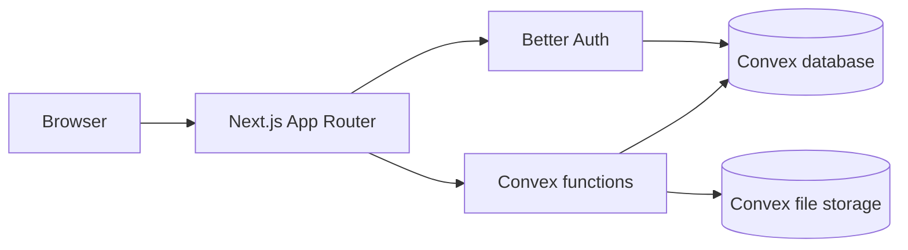

<p align="center">
  
</p>

# Sthana Kampus

<p align="center">
  <strong>Sistem reservasi dan pelaporan fasilitas kampus untuk Project PPK 2026.</strong>
</p>

<p align="center">
  <a href="https://sthana.myudak.com/">Buka aplikasi</a>
  ·
  <a href="https://sthana.myudak.com/tentang">Tentang Sthana</a>
  ·
  <a href="./docs/ARCHITECTURE.md">Arsitektur</a>
  ·
  <a href="./docs/REQUIREMENTS.md">User story</a>
</p>

<p align="center">
  <a href="https://github.com/ZaidaanArd/ProjectPPK/actions/workflows/ci.yml"></a>
  
  
  
</p>

Sthana Kampus adalah aplikasi web untuk mencari fasilitas kampus, memeriksa
ketersediaan jadwal, mengajukan reservasi, dan melaporkan kerusakan dalam satu
alur. Nama _sthāna_ (स्थान) berasal dari bahasa Sanskerta dan merujuk pada
tempat, kediaman, atau posisi—sesuai fokus proyek pada ruang yang dipakai
bersama di lingkungan kampus.

> Proyek ini dikembangkan sebagai tugas akademik Pengembangan Platform Khusus 2026. Repository ini adalah **source of truth** implementasi Sthana Kampus.

## Yang dapat dilakukan

| Peran         | Kemampuan utama                                                                                                          |
| ------------- | ------------------------------------------------------------------------------------------------------------------------ |
| Pengunjung    | Melihat fasilitas dan ketersediaan slot tanpa melihat identitas atau tujuan reservasi                                    |
| Pengguna      | Mendaftar, mengajukan dan membatalkan reservasi, mengirim laporan beserta foto, serta memantau status                    |
| Petugas       | Memproses antrean reservasi, menindaklanjuti laporan, dan memperbarui status operasional fasilitas                       |
| Administrator | Mengelola akun dan fasilitas, memverifikasi pendaftaran, melihat rekap aktivitas, serta mengekspor laporan berbentuk CSV |

Reservasi memakai slot tetap 30 menit pada jam operasional 07.00–20.00 WIB.
Pemeriksaan bentrok dilakukan di backend agar dua reservasi tidak dapat
mengambil fasilitas dan waktu yang sama.

## Arsitektur



- **Next.js 16 dan React 19** untuk halaman publik, portal berbasis peran, dan Route Handlers.
- **Convex** untuk query, mutation, action, database real-time, dan penyimpanan foto laporan.
- **Better Auth** untuk registrasi email/password, session, dan token Convex.
- **Tailwind CSS v4 dan shadcn/ui** sebagai fondasi antarmuka.
- **Zod** untuk kontrak validasi, **Vitest** dan **Playwright** untuk pengujian, serta **Oxfmt**, **Oxlint**, dan **React Doctor** untuk quality gate.

Rancangan lengkap tersedia di [dokumentasi arsitektur](./docs/ARCHITECTURE.md)
dan [kontrak data/API](./docs/DATA-AND-API.md).

## Menjalankan secara lokal

### Prasyarat

- Node.js 24 LTS
- pnpm 11
- Akun Convex

### Instalasi

```bash
git clone https://github.com/ZaidaanArd/ProjectPPK.git
cd ProjectPPK
pnpm install
pnpm convex dev
```

Perintah Convex membuat atau memperbarui `.env.local`. Gunakan
[`.env.example`](./.env.example) sebagai referensi variabel yang dibutuhkan.
Pada terminal kedua, jalankan:

```bash
pnpm dev
```

Aplikasi tersedia di <http://localhost:3000> dan health check di
<http://localhost:3000/api/health>.

Untuk menjalankan frontend dan backend bersama-sama setelah deployment Convex
terkonfigurasi:

```bash
pnpm dev:full
```

## Environment

```dotenv
CONVEX_DEPLOYMENT=dev:your-deployment
NEXT_PUBLIC_CONVEX_URL=https://your-deployment.convex.cloud
NEXT_PUBLIC_CONVEX_SITE_URL=https://your-deployment.convex.site
NEXT_PUBLIC_SITE_URL=http://localhost:3000

# Diisi hanya pada production agar canonical dan indexing aktif.
SITE_URL=https://sthana.myudak.com
```

Secret berikut disimpan pada environment deployment Convex, bukan di Git:

- `BETTER_AUTH_SECRET`
- `SITE_URL`
- `BOOTSTRAP_SECRET`

## Bootstrap data lokal

1. Daftarkan akun pertama melalui `/register`.
2. Promosikan akun tersebut satu kali melalui function `admin:bootstrapFirstAdmin` menggunakan `BOOTSTRAP_SECRET`.
3. Jalankan `seed:demo` dengan secret yang sama untuk menambahkan enam fasilitas contoh.

Bootstrap berhenti menerima promosi setelah administrator pertama tersedia.
Seed bersifat idempotent sehingga aman dijalankan kembali pada environment
pengembangan.

## Perintah penting

| Perintah               | Kegunaan                                                            |
| ---------------------- | ------------------------------------------------------------------- |
| `pnpm dev`             | Menjalankan Next.js pada port 3000                                  |
| `pnpm dev:backend`     | Menjalankan Convex development deployment                           |
| `pnpm dev:full`        | Menjalankan web dan backend bersamaan                               |
| `pnpm test`            | Menjalankan test dengan Vitest                                      |
| `pnpm test:e2e`        | Menjalankan tes browser Playwright                                  |
| `pnpm test:e2e:record` | Membuka situs production untuk merekam klik di Playwright Inspector |
| `pnpm doctor`          | Mengaudit komponen React                                            |
| `pnpm check`           | Format, lint, typecheck, test, peer check, React Doctor, dan build  |
| `pnpm build`           | Membuat production build Next.js                                    |

## Struktur repository

```text
convex/
├── schema.ts          # Tabel dan index domain
├── auth.ts            # Better Auth dan sinkronisasi profil
├── facilities.ts      # Fasilitas dan ketersediaan publik
├── reservations.ts    # Lifecycle reservasi dan conflict guard
├── reports.ts         # Lifecycle laporan dan foto
└── admin.ts           # Akun, analytics, export, bootstrap, dan seed

src/
├── app/               # App Router, layout, page, dan Route Handlers
├── components/        # Public UI, auth UI, dan portal berbasis peran
└── lib/               # Auth client/server, data statis, dan shared helpers

docs/                  # Requirements, arsitektur, roadmap, data/API, SEO, dan tim
public/                # Brand, favicon, serta ilustrasi fasilitas
```

## Tim

| Anggota                                                                 | Tanggung jawab utama                    |
| ----------------------------------------------------------------------- | --------------------------------------- |
| [Muchammad Yuda Tri Ananda](https://github.com/myudak)                  | Primary Lead · Tech Team & Backend Lead |
| [Muhammad Hafidh Zufar Dewantara](https://github.com/hafidhzufar05-web) | QA & Testing Lead                       |
| [Muhammad Zaidaan Ardiyansyah](https://github.com/ZaidaanArd)           | Brand & UI Lead                         |
| [Nayla Husna](https://github.com/naylahusna)                            | Database Lead                           |

Pembagian feature ownership dan aturan review dijelaskan lebih rinci dalam
[`docs/TEAM-WORK.md`](./docs/TEAM-WORK.md).

## Repository dan deployment

- **Source of truth:** [`ZaidaanArd/ProjectPPK`](https://github.com/ZaidaanArd/ProjectPPK)
- **Deployment mirror:** [`myudak/Sthana-ProjectPPK`](https://github.com/myudak/Sthana-ProjectPPK)
- **Production:** [sthana.myudak.com](https://sthana.myudak.com/)
- **Creator:** [Myudak](https://www.myudak.com/)

Perubahan fitur masuk ke repository utama terlebih dahulu. Mirror Myudak hanya
menyediakan sumber deployment Vercel dan tidak menggantikan repository utama.
