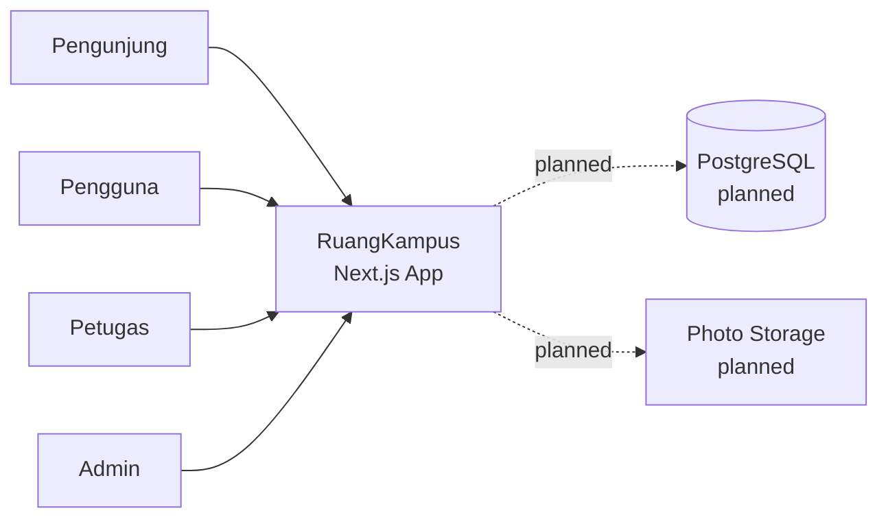
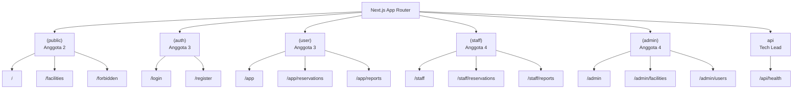
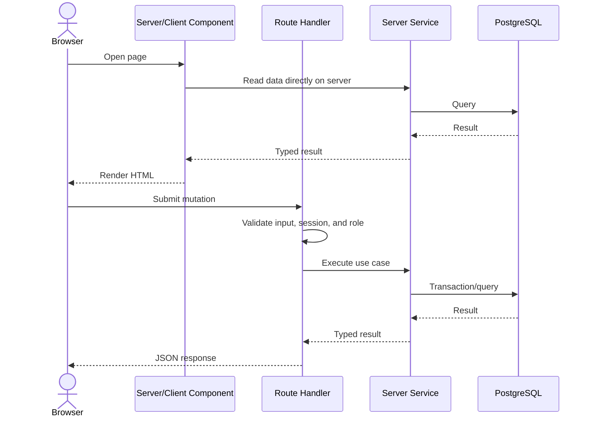
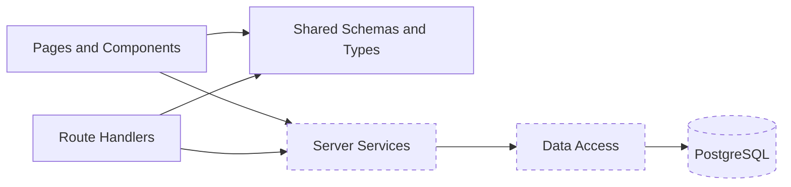

# Arsitektur RuangKampus

> Diagram dengan garis putus-putus atau label **planned** menggambarkan target implementasi, bukan fitur yang sudah tersedia.

## System context



Satu deployment Next.js menangani halaman dan backend Route Handlers. Tidak ada server API terpisah.

## Status arsitektur

| Area    | Sekarang                                 | Target                                           |
| ------- | ---------------------------------------- | ------------------------------------------------ |
| UI      | Placeholder routes dan primitives shadcn | UI responsive per aktor                          |
| Backend | `GET /api/health`                        | Route Handlers untuk auth dan fitur bisnis       |
| Data    | Belum ada database                       | PostgreSQL melalui data-access layer             |
| Auth    | Belum ada                                | Session server-side, cookie aman, dan role guard |
| File    | Belum ada                                | Upload foto laporan melalui storage terpilih     |
| Testing | Lint, typecheck, build                   | Unit, integration, dan browser test              |

## Struktur target

```text
src/
  app/
    (public)/          public pages
    (auth)/            authentication pages
    (user)/            user portal
    (staff)/           staff portal
    (admin)/           admin portal
    api/               external HTTP boundary
  components/
    ui/                shadcn primitives
    public/            planned public components
    user/              planned user components
    staff/             planned staff components
    admin/             planned admin components
  lib/                 shared schema, type, and helpers
  server/              planned server-only code
    auth/
    db/
    services/
```

Route groups membagi ownership tanpa muncul pada URL. Contoh: file di `(user)/app/reservations/page.tsx` tetap menghasilkan `/app/reservations`.

## Route map



## Planned request flow



Server Components nantinya membaca service/data layer langsung. Mereka tidak memanggil Route Handler aplikasi sendiri melalui HTTP. Route Handler digunakan untuk input browser, mutasi, dan integrasi eksternal.

## Aturan arsitektur

1. Komponen client tidak boleh mengimpor modul dari `src/server`.
2. Route Handler hanya menangani HTTP, validasi boundary, dan pemetaan response; business rules berada di service.
3. Semua input eksternal divalidasi ulang di server meskipun sudah divalidasi di client.
4. Pemeriksaan session dan role dilakukan pada setiap operasi sensitif.
5. Mutasi reservasi/approval yang saling bergantung memakai transaksi database.
6. Type/schema bersama berada di `src/lib`; jangan menduplikasi status string di banyak fitur.
7. Gunakan Server Components secara default dan tambahkan `"use client"` hanya saat membutuhkan state, event, atau browser API.

## Dependency direction



UI tidak mengakses database secara langsung. Data-access layer tidak mengimpor komponen atau kode HTTP.
