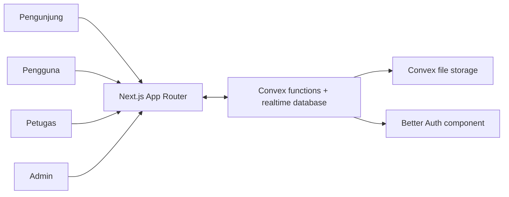
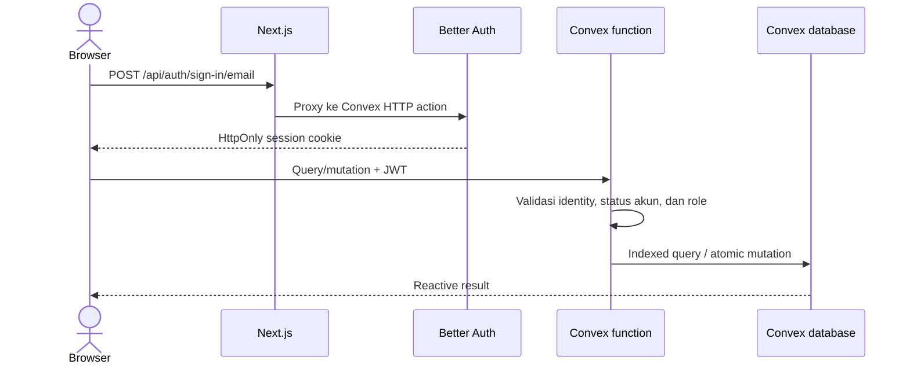

# Arsitektur Sthana Kampus

## System context

Next.js menangani halaman, auth proxy, dan download CSV. Data domain, authorization, validasi server, transaksi approval, dan storage foto berada di Convex. Browser memakai subscription Convex sehingga antrean dan status berubah real-time.

## Request flow

Server layouts memakai token dari cookie untuk guard `/app`, `/staff`, dan `/admin`. Function tetap memeriksa role; route guard bukan satu-satunya pengamanan.

## Route ownership

| Area | URL | Owner |
| --- | --- | --- |
| Public | `/`, `/facilities`, `/tentang` | Anggota 2 |
| Auth/user | `/login`, `/register`, `/app/**` | Anggota 3 |
| Staff/admin | `/staff/**`, `/admin/**` | Anggota 4 |
| Backend/integration | `convex/**`, `src/app/api/**`, `src/lib/auth-*` | Tech Lead |

## Invariants

1. Seluruh Convex function mendeklarasikan validator argumen dan return value.
2. Query operasional memakai index; public availability hanya mengirim waktu yang terblokir.
3. Hanya reservasi `approved` yang memblokir slot. Approval membaca slot yang sama dalam mutation atomik sehingga concurrent approval akan conflict/retry.
4. Waktu disimpan sebagai Unix milliseconds dan divalidasi terhadap 07.00–20.00 WIB, satu hari, kelipatan 30 menit.
5. Foto maksimum 5 MB dan hanya JPEG, PNG, atau WebP; signed URL dibuat setelah authorization.
6. Data historis tidak dihapus secara destruktif. Akun/fasilitas dinonaktifkan dan aksi penting masuk `auditEvents`.

## Deployment

- Source of truth: `ZaidaanArd/ProjectPPK`.
- `myudak/Sthana-ProjectPPK` hanya mirror deployment.
- Next.js dapat dideploy di Vercel; production memakai deployment Convex production yang terpisah dari development.
- Jangan menjalankan `convex deploy` dari branch fitur sebelum review dan environment production siap.
