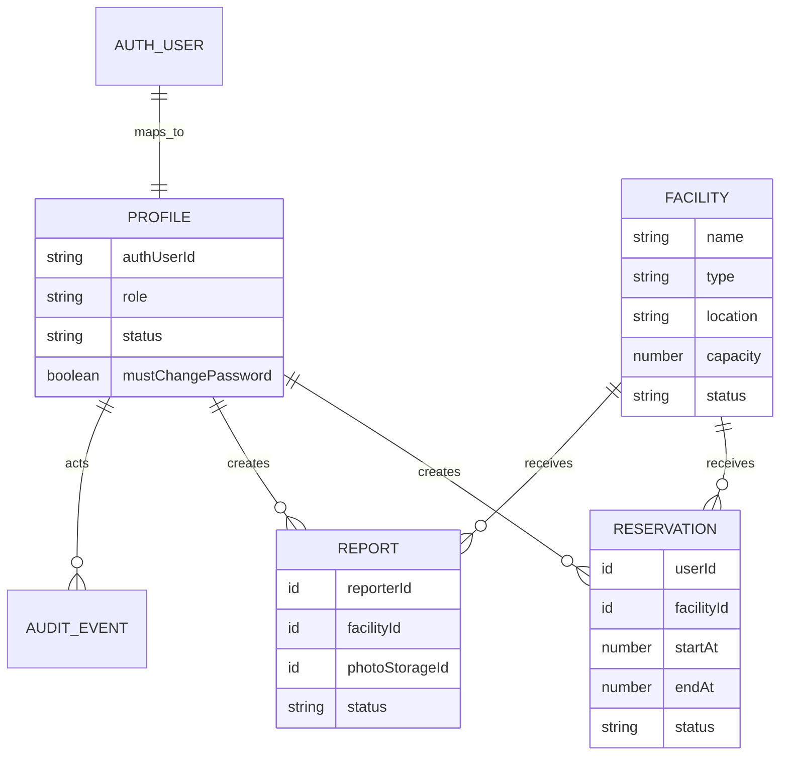

# Data dan interface backend

## Model data

Schema aktual ada di `convex/schema.ts`. Better Auth menyimpan user, credential, session, dan JWKS di isolated Convex component.

## Status

| Domain      | Nilai                                            |
| ----------- | ------------------------------------------------ |
| Role        | `user`, `officer`, `admin`                       |
| Account     | `pending`, `active`, `rejected`, `disabled`      |
| Facility    | `active`, `maintenance`, `inactive`              |
| Reservation | `pending`, `approved`, `rejected`, `cancelled`   |
| Report      | `pending`, `in_progress`, `resolved`, `rejected` |

## Public functions

| Module         | Function                                            | Access        | Purpose                    |
| -------------- | --------------------------------------------------- | ------------- | -------------------------- |
| `profiles`     | `current`, `completeRegistration`, `changePassword` | Session       | Profile dan password       |
| `facilities`   | `listPublic`, `getPublicAvailability`               | Public        | Katalog dan blocked slots  |
| `facilities`   | `listManaged`, `create`, `update`, `setStatus`      | Admin         | Master fasilitas           |
| `reservations` | `listMine`, `create`, `cancelMine`                  | User          | Reservasi milik sendiri    |
| `reservations` | `listQueue`, `decide`, `cancelByStaff`              | Officer/admin | Antrean dan keputusan      |
| `reports`      | `generateUploadUrl`, `create`, `listMine`           | User          | Upload dan laporan sendiri |
| `reports`      | `listQueue`, `updateStatus`                         | Officer/admin | Penanganan laporan         |
| `admin`        | account functions, `analytics`, `exportData`        | Admin         | Administrasi dan rekap     |

Next.js Route Handlers hanya dipakai untuk:

- `/api/auth/[...all]`: proxy Better Auth;
- `/api/admin/export`: file CSV dengan session/role check;
- `/api/health`: health check aplikasi.

## Privacy dan authorization

- Public availability hanya berisi `startAt`, `endAt`, dan status; tidak ada nama pemohon atau tujuan.
- Query user mengambil data berdasarkan `profile._id` dari session, bukan ID dari client.
- Foto laporan hanya menghasilkan URL di query user milik sendiri atau antrean petugas.
- Seluruh admin/staff mutation mengulang pemeriksaan role di backend.

## Aturan reservasi

- 07.00–20.00 WIB, satu hari, slot 30 menit.
- Pengguna dapat membatalkan minimal 1 jam sebelum mulai.
- Pengajuan baru berstatus `pending`; belum memblokir slot.
- Mutation approval mengecek overlap terhadap reservasi approved pada index `by_facility_status_start`.

## Upload

Client meminta upload URL, mengunggah langsung ke Convex storage, lalu mengirim storage ID ke mutation laporan. Server membaca metadata storage dan menolak file lebih dari 5 MB atau MIME selain JPEG/PNG/WebP.
