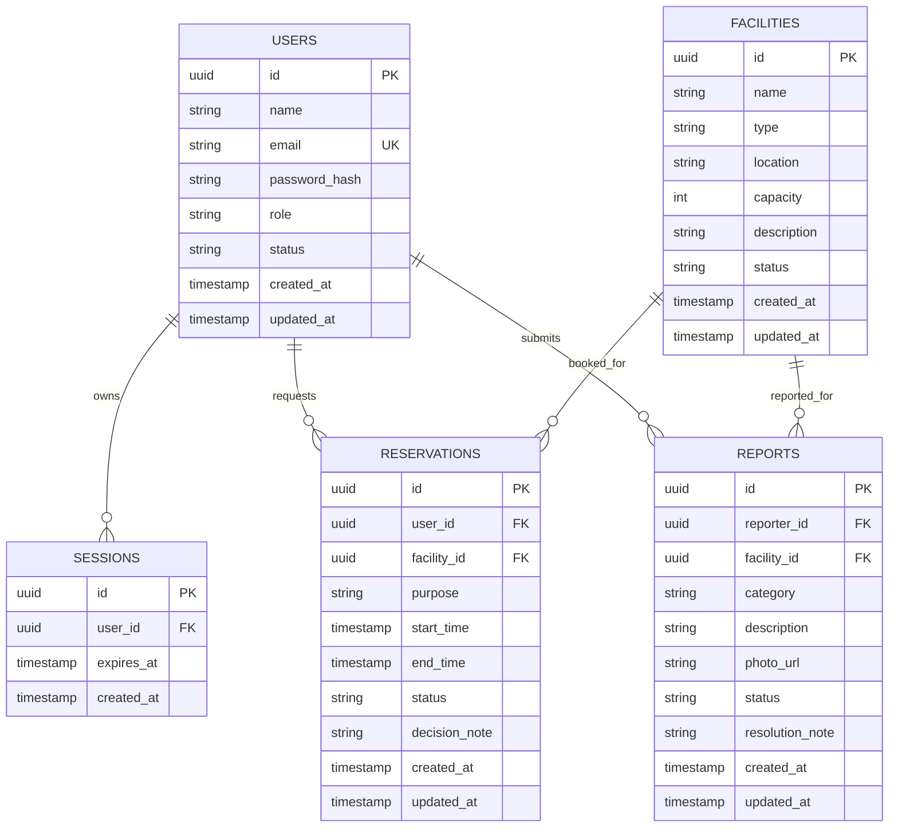

# Rancangan Data dan API

> Selain `GET /api/health`, seluruh isi dokumen ini adalah **blueprint**. Schema database dan endpoint bisnis belum diimplementasikan.

## Current API

### `GET /api/health`

Response `200`:

```json
{
  "status": "ok",
  "service": "ruang-kampus"
}
```

## Planned data model



Atribut timestamp, notes, dan session ditambahkan agar audit perubahan, alasan pembatalan, resolusi laporan, dan autentikasi dapat diterapkan tanpa mengubah entity inti.

## Planned enums

| Domain             | Nilai awal                                       |
| ------------------ | ------------------------------------------------ |
| User role          | `user`, `officer`, `admin`                       |
| Account status     | `pending`, `active`, `rejected`, `disabled`      |
| Facility status    | `active`, `maintenance`, `inactive`              |
| Reservation status | `pending`, `approved`, `rejected`, `cancelled`   |
| Report status      | `pending`, `in_progress`, `resolved`, `rejected` |

Nilai status akan dibuat sebagai schema/type bersama sebelum tabel, API, dan UI menggunakannya.

## Planned validation rules

### Facility

- Nama, tipe, dan lokasi wajib diisi.
- Kapasitas berupa bilangan bulat positif.
- Fasilitas nonaktif/perbaikan tidak dapat menerima approval reservasi baru.

### Reservation

- Waktu berada pada 07.00–20.00 WIB dan di hari yang sama.
- Awal dan akhir sejajar dengan slot 30 menit; akhir harus setelah awal.
- Tujuan penggunaan wajib diisi.
- Hanya reservasi `approved` yang memblokir slot.
- Approval harus mengecek bentrok di dalam transaksi agar dua petugas tidak dapat menyetujui slot yang sama bersamaan.

### Report

- Fasilitas, kategori, dan deskripsi wajib diisi.
- Foto divalidasi berdasarkan tipe, ukuran, dan storage policy yang dipilih tim.
- Laporan `resolved` memiliki catatan resolusi.

## Planned API map

Endpoint berikut adalah rencana minimum dan dapat dibuat satu per satu sesuai roadmap.

| Method    | Path                           | Aktor      | Tujuan                                     |
| --------- | ------------------------------ | ---------- | ------------------------------------------ |
| POST      | `/api/auth/register`           | Pengunjung | Registrasi mandiri                         |
| POST      | `/api/auth/login`              | Pengunjung | Membuat session                            |
| POST      | `/api/auth/logout`             | Login      | Menghapus session                          |
| GET       | `/api/auth/session`            | Semua      | Membaca user aktif atau `null`             |
| GET       | `/api/facilities`              | Semua      | Daftar, filter, dan ketersediaan fasilitas |
| GET       | `/api/facilities/[id]`         | Semua      | Detail fasilitas yang boleh dipublikasikan |
| GET/POST  | `/api/reservations`            | Pengguna   | Riwayat dan pengajuan reservasi            |
| GET/PATCH | `/api/reservations/[id]`       | Pengguna   | Detail dan pembatalan reservasi sendiri    |
| GET/POST  | `/api/reports`                 | Pengguna   | Daftar dan pembuatan laporan               |
| GET       | `/api/reports/[id]`            | Pengguna   | Detail/status laporan sendiri              |
| GET       | `/api/staff/reservations`      | Petugas    | Antrean reservasi                          |
| PATCH     | `/api/staff/reservations/[id]` | Petugas    | Approve, reject, atau cancel dengan alasan |
| GET       | `/api/staff/reports`           | Petugas    | Antrean laporan                            |
| PATCH     | `/api/staff/reports/[id]`      | Petugas    | Status dan catatan resolusi                |
| GET/POST  | `/api/admin/users`             | Admin      | Daftar atau membuat akun                   |
| PATCH     | `/api/admin/users/[id]`        | Admin      | Verifikasi, reject, atau disable akun      |
| POST      | `/api/admin/facilities`        | Admin      | Menambah fasilitas                         |
| PATCH     | `/api/admin/facilities/[id]`   | Admin      | Mengubah/status fasilitas                  |
| GET       | `/api/admin/analytics`         | Admin      | Rekap okupansi dan kerusakan               |
| GET       | `/api/admin/analytics/export`  | Admin      | Export CSV, Excel, atau PDF                |

## Planned HTTP conventions

- JSON digunakan untuk request/response biasa; upload foto memakai `multipart/form-data` atau signed upload sesuai storage decision.
- Validation error menggunakan status `400`, tanpa login `401`, role salah `403`, data tidak ditemukan `404`, dan konflik jadwal `409`.
- Error body konsisten:

```json
{
  "code": "RESERVATION_CONFLICT",
  "message": "Slot fasilitas sudah digunakan.",
  "fieldErrors": {},
  "requestId": "..."
}
```

- Response tidak pernah mengirim password hash, session ID mentah, atau detail pemohon reservasi kepada pengunjung.
