# Alur dan logika sistem

Semua aturan di bawah ditegakkan di backend Convex. Tampilan di browser hanya membantu memilih; server tetap memeriksa ulang setiap permintaan. Kode acuannya ada di `convex/` dan aturan bersama di `convex/lib/`.

## Gambaran besar

### Tiga peran, satu sumber data

Pengguna mengajukan, petugas memutuskan dan menindaklanjuti, admin mengelola data dan akun. Semua membaca data yang sama di Convex, jadi perubahan satu peran langsung terlihat di layar peran lain.

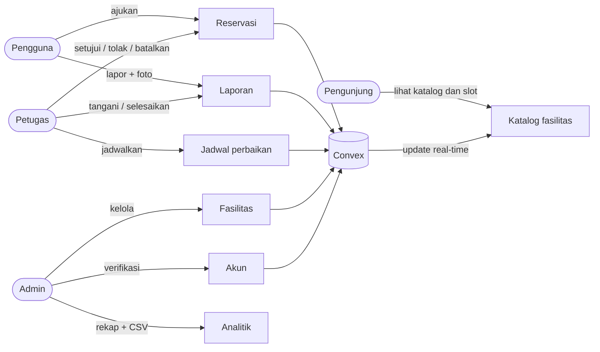

- Pengunjung tanpa akun hanya bisa melihat katalog dan slot yang terisi, tanpa nama pemohon atau tujuan.
- Admin juga bisa melakukan semua tindakan petugas.
- Setiap tindakan penting dicatat di tabel `auditEvents`.

### Perjalanan satu permintaan

Contoh: pengguna mengirim reservasi. Browser memanggil fungsi Convex langsung dengan token sesi; fungsi itu memeriksa identitas, status akun, peran, dan aturan sebelum menulis apa pun.

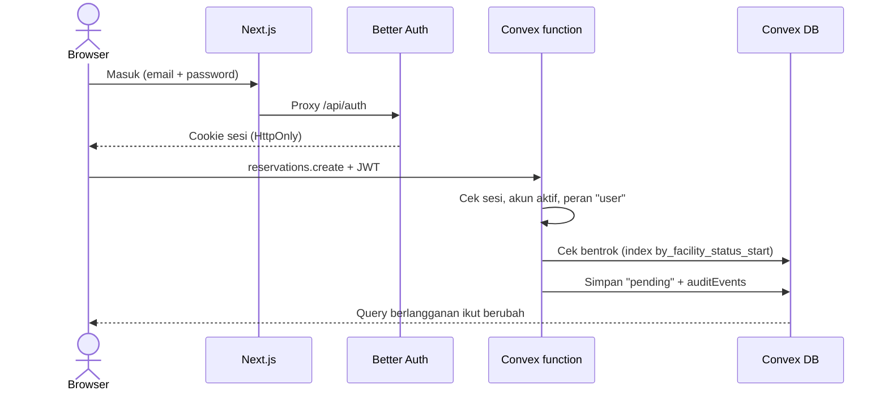

- Satu mutation = satu transaksi: kalau satu pemeriksaan gagal, tidak ada yang tersimpan.
- Data tidak dihapus destruktif; status yang berubah.

## Akun

### Status akun

Daftar mandiri menghasilkan akun `pending` yang belum bisa masuk portal. Admin menyetujui atau menolak (alasan wajib). Akun buatan admin langsung `active` dengan password sementara.

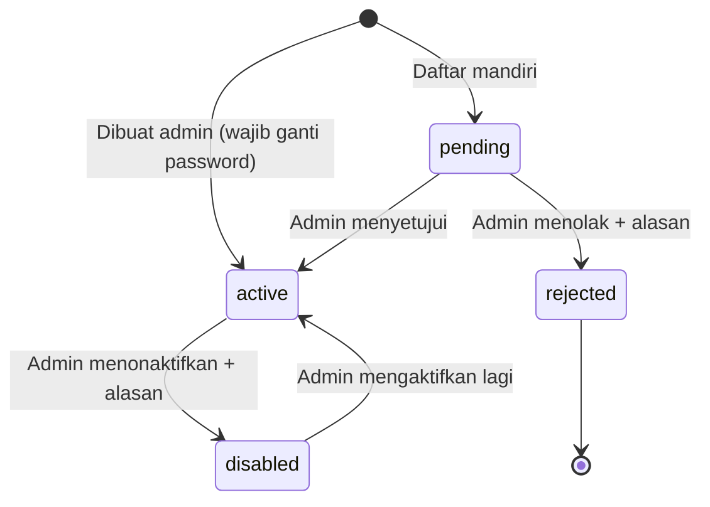

- Admin tidak bisa menonaktifkan akunnya sendiri.
- Akun `pending`, `rejected`, dan `disabled` diarahkan ke halaman status akun, bukan portal.

### Masuk ke portal

Setelah login, server membaca profil lalu mengarahkan ke portal sesuai peran. Halaman portal memeriksa ulang di server, jadi URL tidak bisa ditebak untuk masuk.

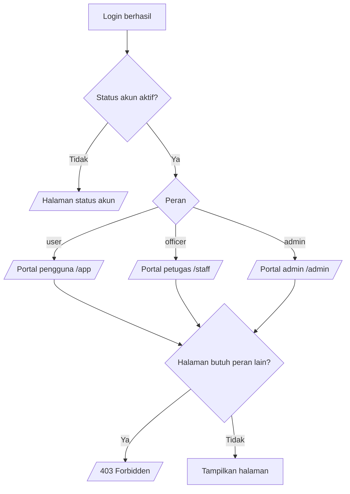

- Pemeriksaan yang sama diulang di setiap fungsi Convex (`requireRole`).
- Satu perangkat bisa menyimpan hingga 5 akun dan berpindah tanpa login ulang.

## Reservasi

### Mengajukan reservasi

Server memeriksa urutan aturan ini. Reservasi yang baru diajukan berstatus `pending` dan belum memblokir slot bagi pengguna lain.

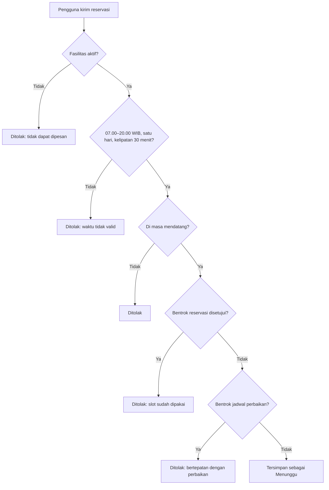

- Beberapa pengajuan menunggu boleh menumpuk di slot yang sama; petugas yang memilih.
- Tujuan penggunaan wajib diisi.

### Status reservasi

Begitu petugas menyetujui satu reservasi, semua pengajuan menunggu yang bentrok dengannya otomatis ditolak sistem dengan catatan yang jelas.

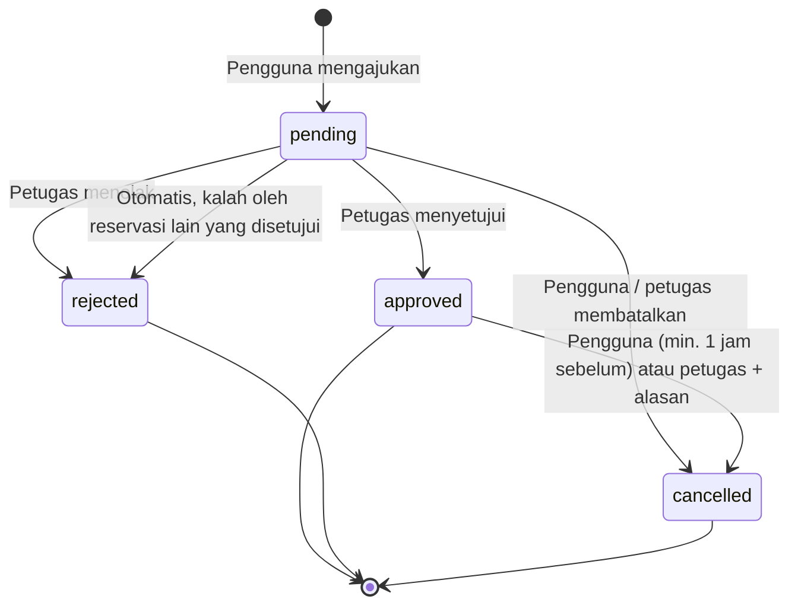

- Pengguna hanya bisa membatalkan minimal 1 jam sebelum mulai.
- Petugas yang membatalkan wajib menulis alasan.
- Penolakan otomatis dicatat di audit sebagai aktor `system`.

### Persetujuan dan penolakan otomatis

Saat petugas menekan Setujui, server memeriksa ulang bentrok di dalam transaksi yang sama, jadi dua petugas yang menyetujui bersamaan tidak bisa menghasilkan dua reservasi di slot yang sama.

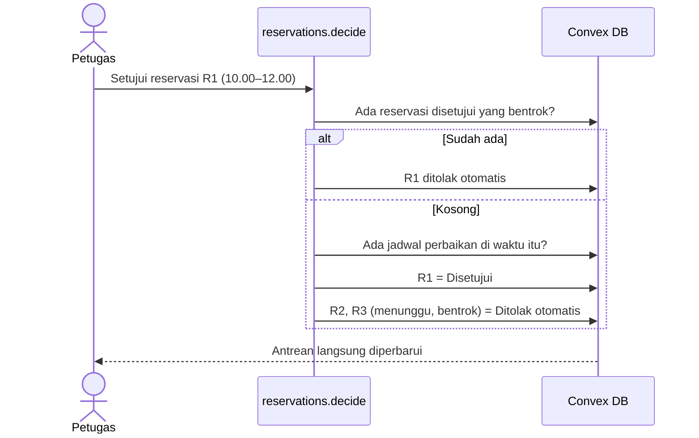

- Reservasi yang bersebelahan (10.00–12.00 dan 12.00–13.00) tidak dianggap bentrok.

## Laporan fasilitas

### Status laporan

Laporan baru berstatus `pending`. Menyelesaikan atau menolak wajib disertai catatan penanganan, dan status yang sudah ditutup tidak bisa dibuka lagi.

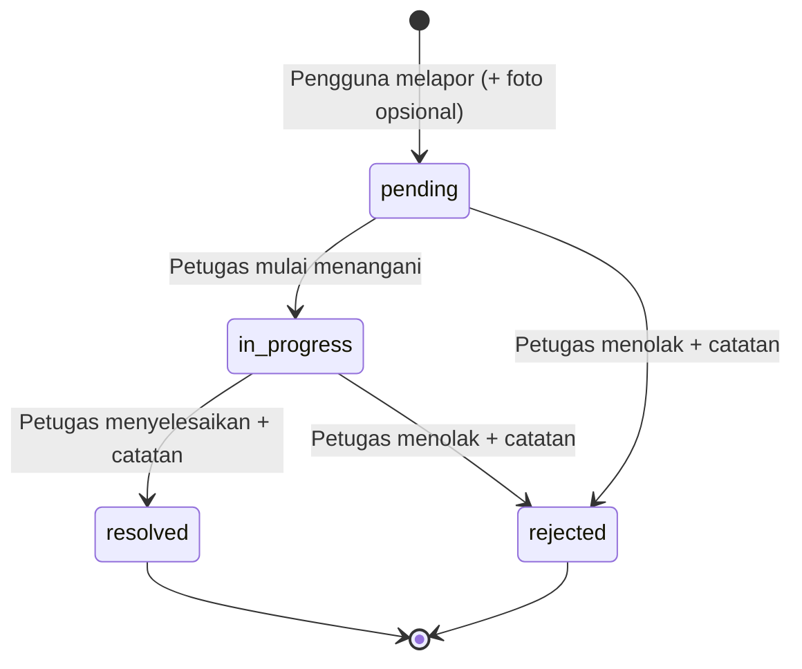

- Foto maksimal 5 MB, hanya JPG, PNG, atau WebP; server memeriksa ulang metadata file.
- Saat laporan ditutup, jadwal perbaikan yang terkait ikut diakhiri.

### Dari laporan ke perbaikan

Laporan tidak lagi mematikan fasilitas seharian. Petugas menjadwalkan perbaikan di waktu yang kosong, langsung dari kartu laporan.

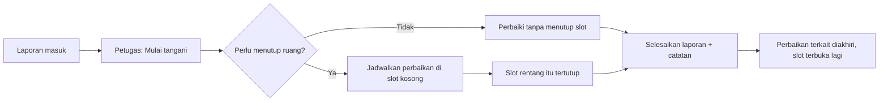

- Perbaikan yang sudah berjalan diakhiri saat itu juga; yang belum mulai dibatalkan.

## Jadwal perbaikan

### Aturan utama

Perbaikan dan reservasi tidak boleh tumpang tindih, dan perbaikan yang mengalah: perbaikan hanya boleh mengambil waktu yang benar-benar kosong.

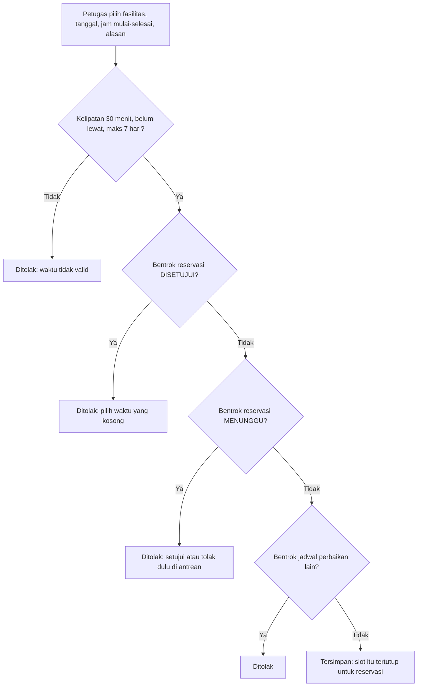

- Reservasi yang sudah disetujui tetap berjalan; perbaikan harus mencari waktu lain.
- Pengajuan menunggu tidak ditolak diam-diam oleh sistem; petugas yang memutuskannya dulu.
- Jam lain di hari yang sama tetap bisa dipesan.

### Status jadwal perbaikan

Jam selesai wajib diisi sebagai perkiraan. Jadwal berakhir otomatis di jam itu lewat scheduled function Convex, atau lebih cepat kalau petugas menekan Selesai.

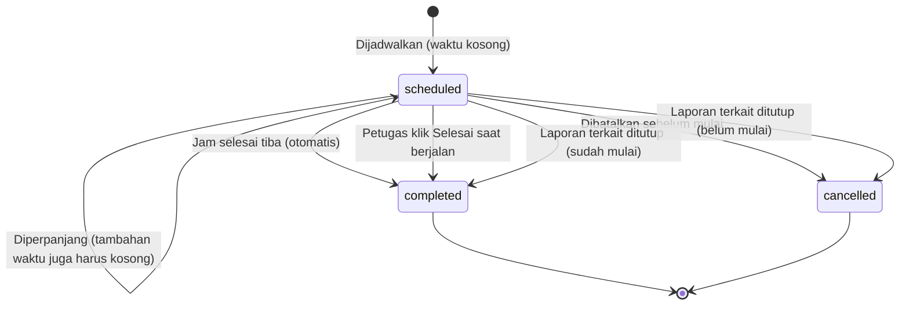

- Status "Berlangsung" atau "Terjadwal" dihitung dari jam sekarang terhadap rentang `startAt`–`endAt`.
- Satu jadwal maksimal 7 hari; penutupan lebih lama memakai status Nonaktif milik admin.

### Contoh kasus: kelas sudah direservasi lalu perlu diperbaiki

Reservasi yang sudah disetujui tetap jalan. Perbaikan dijadwalkan di waktu kosong berikutnya, dan selama perbaikan slot itu tidak bisa direservasi.

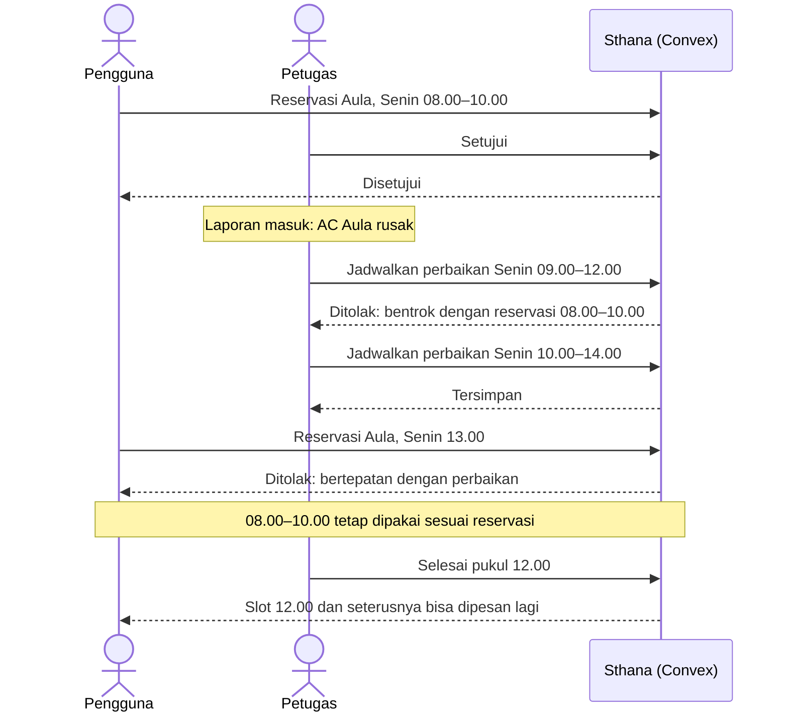

- Kalau perbaikan butuh lebih lama, petugas memperpanjang; tambahan waktunya juga harus kosong.

### Data jadwal perbaikan

Jadwal perbaikan disimpan di tabel sendiri, terhubung ke fasilitas dan, bila dibuat dari laporan, ke laporan itu.

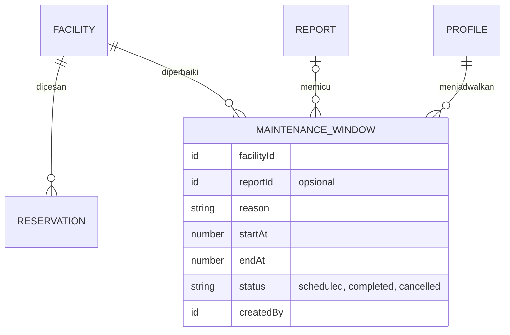

- Index `by_facility_status_start` dipakai untuk cek bentrok, sama seperti reservasi.
- Status fasilitas lama `maintenance` (menutup seluruh fasilitas) tidak bisa dipasang lagi; admin hanya bisa mengaktifkannya kembali.

## Hak akses

### Siapa boleh melakukan apa

Setiap fungsi Convex memanggil `requireRole` sebelum membaca atau menulis data. Tombol yang disembunyikan di UI bukan satu-satunya pengaman.

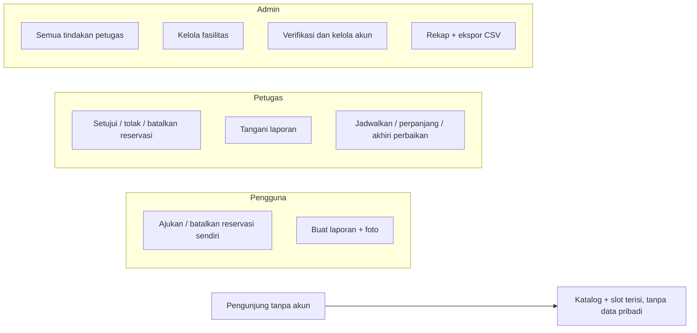

- Query pengguna selalu memakai ID profil dari sesi, bukan ID kiriman browser.
- Ekspor CSV memeriksa sesi dan peran admin di server.
