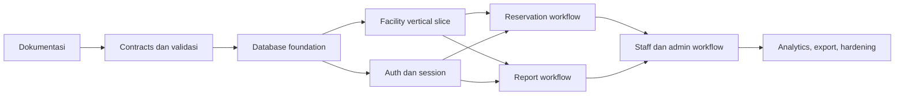
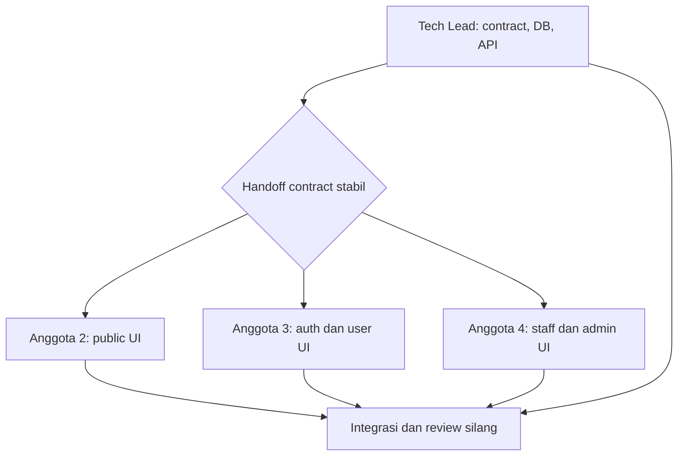

# Roadmap Implementasi

> Dokumen ini adalah rencana kerja, bukan daftar fitur yang sudah tersedia. Kondisi repository saat ini masih berupa scaffold Next.js dengan halaman placeholder dan `GET /api/health`.

## Cara memakai roadmap

- Satu item idealnya selesai dalam satu pull request kecil.
- Kerjakan item hanya jika seluruh dependensinya sudah selesai.
- Owner adalah penanggung jawab utama, bukan satu-satunya orang yang boleh membantu.
- Reviewer mengikuti matriks di [TEAM-WORK.md](./TEAM-WORK.md).
- Jangan menggabungkan perubahan database, API, dan beberapa halaman besar dalam satu PR.

## Urutan delivery

Alur tersebut sengaja membuat fasilitas sebagai vertical slice pertama. Tim dapat belajar pola schema → service → Route Handler → UI pada domain yang paling sederhana sebelum mengerjakan autentikasi dan workflow transaksi.

## Milestone 0 — Fondasi bersama

Tujuan: semua anggota memiliki bahasa domain, aturan validasi, dan lingkungan pengembangan yang sama.

| ID    | Owner     | Pekerjaan atomik                    | Output                                                      | Dependensi |
| ----- | --------- | ----------------------------------- | ----------------------------------------------------------- | ---------- |
| D-01  | Tech Lead | Rapikan dokumen proyek              | Requirements, diagram, pembagian tim, dan roadmap           | —          |
| C-01  | Tech Lead | Definisikan enum dan tipe domain    | `src/lib/contracts/domain.ts` untuk role dan seluruh status | D-01       |
| C-02  | Tech Lead | Definisikan schema fasilitas        | Zod schema input/output fasilitas beserta unit test         | C-01       |
| C-03  | Tech Lead | Definisikan format response API     | Helper success dan error envelope beserta test              | C-01       |
| DB-01 | Tech Lead | Pasang Drizzle dan PostgreSQL       | Dependency, config, dan `.env.example` tanpa tabel domain   | C-01       |
| DB-02 | Tech Lead | Tambahkan utilitas koneksi database | Koneksi lazy yang tidak berjalan saat build                 | DB-01      |
| Q-01  | Anggota 2 | Buat shell halaman publik           | Header, navigation, container, dan responsive states        | D-01       |
| Q-02  | Anggota 3 | Buat shell portal pengguna          | Sidebar/header placeholder dan responsive states            | D-01       |
| Q-03  | Anggota 4 | Buat shell portal petugas/admin     | Navigation terpisah untuk staff dan admin                   | D-01       |

Exit criteria:

- Kontrak dasar dapat diimpor dari server maupun komponen client.
- Database lokal dapat dinyalakan dan migration kosong dapat dijalankan.
- Ketiga shell tidak mengandung data palsu yang menyerupai fitur selesai.

## Milestone 1 — Fasilitas read-only

Tujuan: menghasilkan vertical slice pertama dari database sampai halaman publik.

| ID   | Owner     | Pekerjaan atomik                | Output                                                            | Dependensi  |
| ---- | --------- | ------------------------------- | ----------------------------------------------------------------- | ----------- |
| F-01 | Tech Lead | Buat tabel fasilitas            | Schema dan migration `facilities`                                 | DB-02, C-02 |
| F-02 | Tech Lead | Buat seed fasilitas             | Beberapa fasilitas lokal yang representatif                       | F-01        |
| F-03 | Tech Lead | Buat query daftar fasilitas     | DAL read-only dengan test                                         | F-02        |
| F-04 | Tech Lead | Buat endpoint daftar fasilitas  | `GET /api/facilities` dengan validasi response                    | F-03, C-03  |
| F-05 | Anggota 2 | Buat kartu fasilitas            | Komponen reusable untuk nama, tipe, lokasi, kapasitas, dan status | Q-01, C-02  |
| F-06 | Anggota 2 | Hubungkan halaman `/facilities` | Daftar fasilitas, empty state, loading, dan error state           | F-03, F-05  |
| F-07 | Anggota 2 | Tambahkan filter tampilan       | Filter tipe/lokasi tanpa mengubah data server                     | F-06        |
| F-08 | Tech Lead | Integration test fasilitas      | Test DAL, endpoint, serta akses halaman anonim                    | F-04, F-06  |

Exit criteria:

- Pengunjung dapat melihat fasilitas nyata dari database tanpa login.
- UI tidak menampilkan detail pemohon atau tujuan reservasi.
- API dan halaman memiliki empty/error state yang dapat diuji.

## Milestone 2 — Autentikasi dan otorisasi

Tujuan: menyediakan identitas pengguna dan pembatasan route berdasarkan role.

| ID   | Owner     | Pekerjaan atomik                   | Output                                                 | Dependensi       |
| ---- | --------- | ---------------------------------- | ------------------------------------------------------ | ---------------- |
| A-01 | Tech Lead | Buat tabel users dan sessions      | Schema, migration, constraint, dan index               | DB-02, C-01      |
| A-02 | Tech Lead | Buat password utilities            | Hash dan verify password beserta unit test             | A-01             |
| A-03 | Tech Lead | Buat session service               | Cookie aman, create/read/delete session, expiry test   | A-01             |
| A-04 | Tech Lead | Buat endpoint registrasi           | Validasi, duplicate email handling, dan error envelope | A-02, A-03, C-03 |
| A-05 | Tech Lead | Buat endpoint login/logout/session | Route Handlers dan integration test                    | A-02, A-03, C-03 |
| A-06 | Anggota 3 | Buat form registrasi               | Accessible form dengan client validation               | Q-02, A-04       |
| A-07 | Anggota 3 | Buat form login                    | Error state, pending state, dan redirect sukses        | Q-02, A-05       |
| A-08 | Tech Lead | Pasang route guard                 | Redirect anonim dan forbidden untuk role salah         | A-03, A-05       |
| A-09 | Anggota 3 | Hubungkan user portal              | Session-aware navigation dan logout                    | A-05, A-07, A-08 |

Exit criteria:

- Registrasi, login, logout, dan session persistence bekerja.
- Route user, staff, dan admin memiliki guard server-side.
- Password tidak pernah disimpan atau dikirim kembali sebagai response.

## Milestone 3 — Reservasi

Tujuan: pengguna dapat membuat, melihat, dan membatalkan reservasi; petugas dapat memprosesnya.

| ID   | Owner     | Pekerjaan atomik                  | Output                                                    | Dependensi       |
| ---- | --------- | --------------------------------- | --------------------------------------------------------- | ---------------- |
| R-01 | Tech Lead | Definisikan contract reservasi    | Zod schema dengan aturan tanggal dan slot 30 menit        | C-01, F-01       |
| R-02 | Tech Lead | Buat tabel reservasi              | Schema, migration, relasi, dan index                      | A-01, F-01, R-01 |
| R-03 | Tech Lead | Buat availability service         | Deteksi bentrok dan status fasilitas                      | R-02             |
| R-04 | Tech Lead | Buat endpoint reservasi pengguna  | Create/list/detail/cancel milik pengguna                  | R-03, A-08, C-03 |
| R-05 | Anggota 3 | Buat form reservasi               | Pilihan fasilitas, tanggal, slot, tujuan, dan error state | R-01, R-04       |
| R-06 | Anggota 3 | Buat riwayat dan detail reservasi | List, status badge, detail, dan aksi pembatalan           | R-04             |
| R-07 | Tech Lead | Buat endpoint keputusan petugas   | Approve/reject/cancel dengan transaksi                    | R-03, R-04       |
| R-08 | Anggota 4 | Buat antrean reservasi petugas    | Filter, detail, approve/reject/cancel states              | Q-03, R-07       |
| R-09 | Tech Lead | Tambahkan concurrency test        | Dua approval tidak dapat menghasilkan jadwal bentrok      | R-07             |

Exit criteria:

- Aturan jam 07.00–20.00 WIB dan slot 30 menit dipastikan di server.
- Bentrok dicegah dalam transaksi, bukan hanya melalui UI.
- Pengguna hanya dapat membaca dan membatalkan reservasinya sendiri.

## Milestone 4 — Laporan kerusakan

Tujuan: pengguna dapat membuat laporan dan petugas dapat menangani lifecycle laporan.

| ID   | Owner     | Pekerjaan atomik                             | Output                                                               | Dependensi       |
| ---- | --------- | -------------------------------------------- | -------------------------------------------------------------------- | ---------------- |
| P-01 | Tech Lead | Definisikan contract laporan                 | Zod schema kategori, deskripsi, foto, dan status                     | C-01, F-01       |
| P-02 | Tech Lead | Buat tabel laporan                           | Schema, migration, relasi, dan index                                 | A-01, F-01, P-01 |
| P-03 | Tech Lead | Putuskan dan dokumentasikan penyimpanan foto | Adapter storage serta batas tipe/ukuran file                         | P-01             |
| P-04 | Tech Lead | Buat endpoint laporan pengguna               | Create/list/detail milik pengguna                                    | P-02, P-03, A-08 |
| P-05 | Anggota 3 | Buat form dan status laporan                 | Upload state, validasi, daftar, dan detail                           | P-04             |
| P-06 | Tech Lead | Buat endpoint proses laporan                 | Start/resolve dengan catatan resolusi dan transaksi status fasilitas | P-04             |
| P-07 | Anggota 4 | Buat antrean laporan petugas                 | Filter, detail foto, start, dan resolve states                       | Q-03, P-06       |
| P-08 | Tech Lead | Integration test lifecycle laporan           | Status laporan dan fasilitas tetap sinkron                           | P-06, P-07       |

Exit criteria:

- Foto divalidasi di server dan disimpan melalui adapter yang disepakati.
- Fasilitas menjadi `maintenance` saat laporan ditangani dan kembali `active` setelah selesai.
- Pengguna hanya dapat melihat laporan miliknya sendiri.

## Milestone 5 — Administrasi

Tujuan: admin dapat mengelola master fasilitas, akun, dan verifikasi registrasi.

| ID   | Owner     | Pekerjaan atomik                        | Output                                             | Dependensi |
| ---- | --------- | --------------------------------------- | -------------------------------------------------- | ---------- |
| M-01 | Tech Lead | Buat endpoint CRUD fasilitas admin      | Create/update/deactivate dengan audit fields       | F-04, A-08 |
| M-02 | Anggota 4 | Buat halaman kelola fasilitas           | Tabel dan form tambah/edit/nonaktifkan             | Q-03, M-01 |
| M-03 | Tech Lead | Buat endpoint provisioning akun         | Admin membuat user/officer dan meninjau registrasi | A-04, A-08 |
| M-04 | Anggota 4 | Buat halaman kelola pengguna            | Daftar, tambah akun, verify, dan reject states     | Q-03, M-03 |
| M-05 | Tech Lead | Tambahkan audit dan authorization tests | Role matrix untuk seluruh endpoint admin           | M-01, M-03 |

Exit criteria:

- Hanya admin yang dapat memanggil endpoint administrasi.
- Fasilitas yang memiliki histori tidak dihapus secara destruktif.
- Semua aksi sensitif tervalidasi ulang di server.

## Milestone 6 — Rekap, kualitas, dan penyerahan

Tujuan: menutup kebutuhan tugas kuliah dan menyiapkan demo yang stabil.

| ID   | Owner     | Pekerjaan atomik                          | Output                                              | Dependensi          |
| ---- | --------- | ----------------------------------------- | --------------------------------------------------- | ------------------- |
| X-01 | Tech Lead | Buat query rekap okupansi                 | Agregasi per fasilitas dan periode                  | R-09                |
| X-02 | Tech Lead | Buat query frekuensi kerusakan            | Agregasi laporan per fasilitas/lokasi               | P-08                |
| X-03 | Anggota 4 | Buat tampilan rekap admin                 | Filter, summary, table, dan empty state             | X-01, X-02          |
| X-04 | Tech Lead | Buat export CSV/Excel/PDF                 | Endpoint export dengan authorization dan test       | X-01, X-02          |
| X-05 | Semua     | Accessibility dan responsive pass         | Keyboard, labels, contrast, desktop/mobile          | Seluruh UI selesai  |
| X-06 | Tech Lead | Security dan error-handling pass          | Rate limit decision, upload checks, safe errors     | Seluruh API selesai |
| X-07 | Semua     | Siapkan data demo dan skenario presentasi | Seed final dan alur demo per aktor                  | X-03, X-04          |
| X-08 | Semua     | Siapkan dokumen pengumpulan               | Word, screenshot, setup, akun demo, dan link source | X-05, X-06, X-07    |

## Jalur kerja paralel

Setelah fondasi untuk suatu milestone tersedia, UI dapat dikerjakan paralel dengan test dan endpoint berikutnya.

Handoff dianggap stabil ketika schema input/output sudah disepakati, contoh response tersedia, dan perubahan breaking diumumkan kepada seluruh tim.

## Definition of Done per item

Sebuah item baru boleh ditandai selesai jika:

- scope item dan acceptance criteria terpenuhi;
- tidak mengambil ownership folder anggota lain tanpa koordinasi;
- loading, empty, error, dan permission state yang relevan ditangani;
- test ditambahkan sesuai risiko perubahan;
- `pnpm format:check`, `pnpm lint`, dan `pnpm typecheck` lulus;
- `pnpm build` lulus untuk perubahan yang memengaruhi runtime;
- dokumentasi/API contract diperbarui jika interface berubah;
- minimal satu anggota lain sudah melakukan review;
- commit message menjelaskan satu perubahan yang bermakna.

## Pekerjaan berikutnya yang direkomendasikan

Setelah paket dokumentasi `D-01` disetujui tim, mulai dari `C-01` (enum dan tipe domain). Sementara Tech Lead mengerjakan kontrak, Anggota 2–4 dapat mengambil `Q-01`, `Q-02`, dan `Q-03` secara paralel karena batas foldernya tidak saling bertabrakan.
