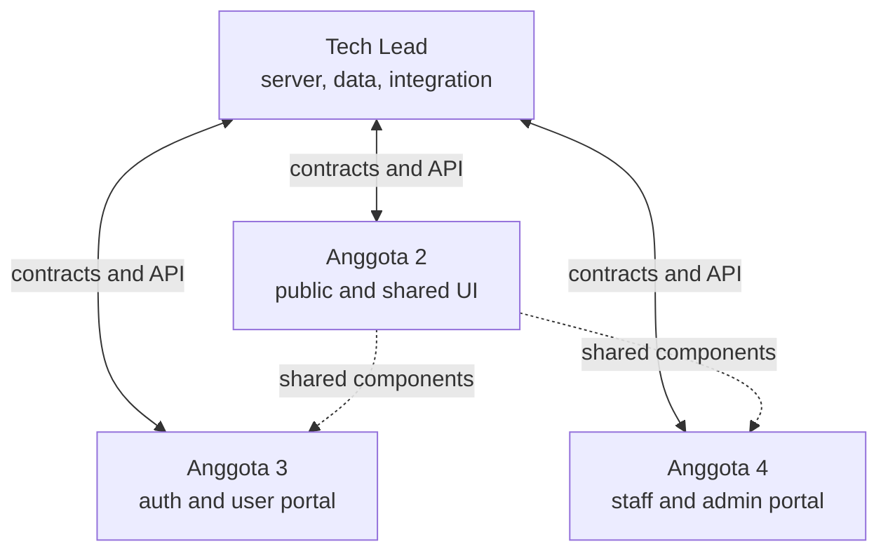
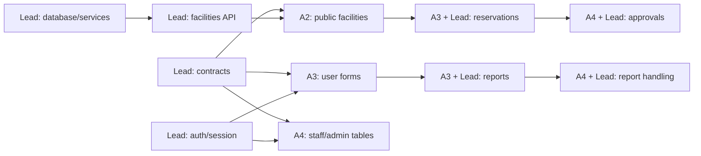
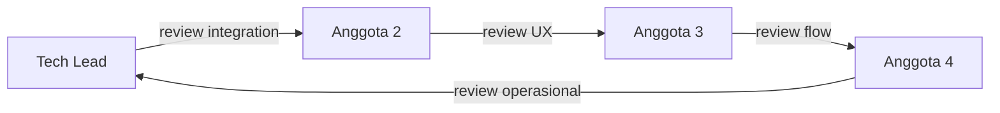

# Pembagian Tim RuangKampus

## Prinsip pembagian

Project dimulai dari scaffold bersama. Placeholder route bukan fitur selesai. Feature owner bertanggung jawab terhadap pengalaman pengguna dan acceptance criteria; Tech Lead menjadi backend/integration partner untuk semua feature slice.

| Anggota          | Fokus utama                                                                                       |
| ---------------- | ------------------------------------------------------------------------------------------------- |
| Kamu / Tech Lead | Arsitektur, kontrak, database, API/service, auth/session, integrasi, quality gate, dan deployment |
| Anggota 2        | Shared UI, public experience, fasilitas, pencarian, ketersediaan, dan responsive UI               |
| Anggota 3        | Auth UI, portal pengguna, reservasi/laporan pengguna, dan client validation                       |
| Anggota 4        | Portal petugas/admin, antrean, status operasional, user/facility management, dan export UI        |



## Ownership folder

| Pemilik   | Boleh mengubah langsung                                                              | Perlu koordinasi                                     |
| --------- | ------------------------------------------------------------------------------------ | ---------------------------------------------------- |
| Tech Lead | Root config, `src/lib`, `src/server`, `src/app/api`                                  | Route UI milik anggota lain                          |
| Anggota 2 | `src/components/ui`, `src/components/public`, `src/app/(public)`                     | Perubahan primitives yang sudah dipakai anggota lain |
| Anggota 3 | `src/components/auth`, `src/components/user`, `src/app/(auth)`, `src/app/(user)`     | Contract/API dan shared navigation                   |
| Anggota 4 | `src/components/staff`, `src/components/admin`, `src/app/(staff)`, `src/app/(admin)` | Contract/API dan shared tables/status                |

Folder `src/server` dan component domain baru dibuat ketika task implementasi pertama membutuhkannya. Jangan membuat folder kosong hanya agar struktur terlihat lengkap.

## Deliverable Tech Lead

### Platform dan data

- Menetapkan shared Zod schema/type untuk role, status, facility, reservation, dan report.
- Menyiapkan PostgreSQL, ORM, environment validation, migration, dan seed development.
- Membuat data-access dan service layer yang digunakan Server Components serta Route Handlers.
- Menjaga constraint dan transaksi agar approval reservasi tidak mengalami race condition.

### Auth dan API

- Implementasi password hashing, registrasi, login, logout, session, cookie, dan role guard.
- Menetapkan HTTP error format, request ID, validasi server, dan authorization setiap endpoint.
- Menyediakan endpoint yang dibutuhkan Anggota 2–4 sesuai urutan roadmap.
- Menentukan storage foto dan generator export bersama tim sebelum implementasi terkait dimulai.

### Integration dan delivery

- Review contract antara UI dan backend sebelum kedua sisi dikerjakan.
- Menangani integrasi lintas route, CI, environment docs, migration verification, dan deployment.
- Menulis integration test untuk auth, authorization, conflict reservation, dan error response.
- Menjaga `main` selalu dapat di-install dan di-build.

## Deliverable Anggota 2

- Menjaga design tokens dan primitives shadcn tetap konsisten serta accessible.
- Membuat public header/navigation, landing page, dan responsive shell.
- Implementasi daftar fasilitas, filter tipe/lokasi/kapasitas, empty state, loading state, dan error state.
- Menampilkan ketersediaan per slot tanpa membocorkan pemohon atau tujuan reservasi.
- Menyediakan komponen fasilitas reusable yang dapat dipakai portal lain setelah direview.
- Menguji public route pada desktop/mobile serta keyboard navigation.

## Deliverable Anggota 3

- Membuat layout login/register dan pesan status verifikasi akun.
- Membuat portal navigation pengguna.
- Implementasi form reservasi, riwayat, detail, status, dan pembatalan milik sendiri.
- Implementasi form laporan dengan kategori, deskripsi, foto, riwayat, dan status.
- Menambahkan client-side validation memakai schema yang disepakati dengan Tech Lead.
- Menguji state form, validation feedback, success/error state, dan responsive behavior.

## Deliverable Anggota 4

- Membuat dashboard dan navigation untuk petugas/admin.
- Implementasi antrean reservasi serta aksi approve/reject/cancel berikut dialog alasan.
- Implementasi antrean laporan, perubahan status, catatan resolusi, dan status perbaikan fasilitas.
- Implementasi UI pembuatan/verifikasi akun serta pengelolaan fasilitas oleh admin.
- Membuat tampilan rekap okupansi/kerusakan dan tombol export dengan state yang jelas.
- Menguji table state, filter, confirmation dialog, permission state, dan responsive behavior.

## Pembagian user story

Tech Lead adalah backend/integration partner pada semua baris.

| User story | Feature owner | Reviewer utama | Ringkasan                                             |
| ---------- | ------------- | -------------- | ----------------------------------------------------- |
| US-01      | Anggota 2     | Anggota 3      | Daftar fasilitas dan ketersediaan tanpa detail privat |
| US-02      | Anggota 2     | Anggota 4      | Filter tipe, lokasi, dan kapasitas                    |
| US-03      | Anggota 3     | Anggota 2      | Pengajuan reservasi                                   |
| US-04      | Anggota 3     | Anggota 4      | Pembatalan reservasi sendiri                          |
| US-05      | Anggota 3     | Anggota 2      | Riwayat, status, dan detail reservasi                 |
| US-06      | Anggota 3     | Anggota 4      | Laporan kerusakan dengan foto                         |
| US-07      | Anggota 3     | Anggota 2      | Status laporan pengguna                               |
| US-08      | Anggota 4     | Anggota 3      | Dashboard/antrean petugas                             |
| US-09      | Anggota 4     | Tech Lead      | Approve/reject dan pencegahan bentrok                 |
| US-10      | Anggota 4     | Anggota 3      | Pembatalan mendesak dengan alasan                     |
| US-11      | Anggota 4     | Anggota 3      | Proses laporan dan catatan resolusi                   |
| US-12      | Anggota 4     | Anggota 2      | Status dalam perbaikan/aktif kembali                  |
| US-13      | Anggota 4     | Tech Lead      | Pembuatan akun petugas                                |
| US-14      | Anggota 4     | Tech Lead      | Pembuatan akun pengguna oleh admin                    |
| US-15      | Anggota 4     | Anggota 3      | Verifikasi/reject registrasi mandiri                  |
| US-16      | Anggota 4     | Anggota 2      | Pengelolaan fasilitas                                 |
| US-17      | Tech Lead     | Anggota 4      | Rekap dan export CSV/Excel/PDF                        |

Detail acceptance setiap user story terdapat di [REQUIREMENTS.md](REQUIREMENTS.md).

## Dependency antaranggota



Anggota boleh mulai UI menggunakan typed fixture setelah contract disetujui. Fixture harus berada dekat feature dan dihapus ketika API integration selesai; jangan membuat API palsu global.

## Git workflow

### Branch

Gunakan pola berikut:

```text
docs/<topik>
chore/<infrastruktur>
feat/<domain>-<hasil-kecil>
fix/<domain>-<masalah>
```

Contoh: `feat/public-facility-filter`, `feat/user-reservation-form`, atau `feat/staff-report-status`.

### Commit

Setiap anggota membuat minimal tiga commit bermakna selama project. Commit harus kecil, dapat dibuild, dan memiliki satu tujuan.

```text
feat(facilities): add facility filter form
feat(reservations): validate thirty minute slots
test(reports): cover resolution status update
docs(team): update completed user stories
```

### Pull request checklist

- [ ] Scope PR hanya satu hasil kecil yang jelas.
- [ ] Tidak ada file ownership lain yang diubah tanpa koordinasi.
- [ ] Loading, empty, error, dan success state ditangani bila relevan.
- [ ] Client dan server validation sesuai contract.
- [ ] Tidak ada data privat bocor ke public response/UI.
- [ ] `pnpm check` berhasil.
- [ ] Screenshot desktop/mobile dilampirkan untuk perubahan UI.
- [ ] Minimal satu reviewer menyetujui.

## Review silang



Reviewer memeriksa behavior dan acceptance criteria, bukan hanya tampilan. PR Tech Lead tetap harus direview anggota lain agar kontribusi tidak bergantung pada satu orang.
